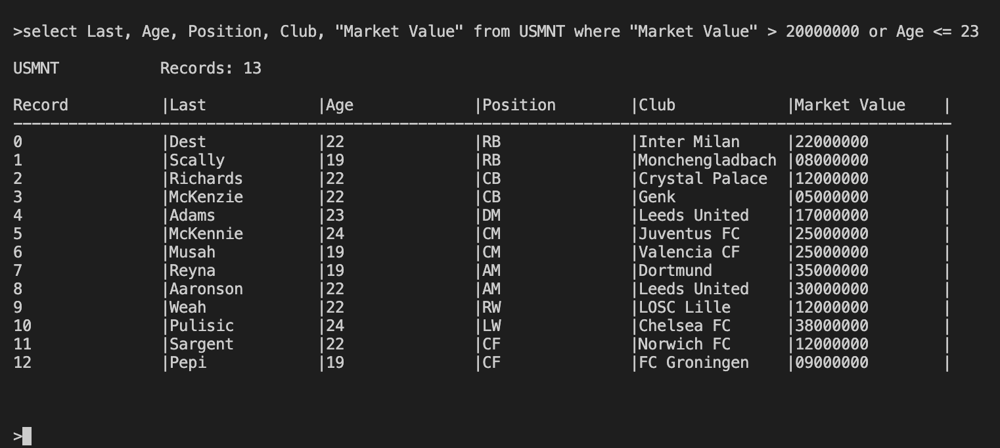

<a name="readme-top"></a>

<!-- PROJECT LOGO -->
<br />
<div align="center">
  <a href="https://github.com/cgarcia156/My-Local-Database">
    
  </a>
  
  <h3 align="center">My Local Database</h3>

  <p align="center">
    <br />
    <a href="https://youtu.be/S2cTakG0kqw">View Demo</a>
    ·
    <a href="https://github.com/cgarcia156/My-Local-Database/issues">Report Bug</a>
    ·
    <a href="https://github.com/cgarcia156/My-Local-Database/issues">Request Feature</a>
  </p>
</div>


<!-- TABLE OF CONTENTS -->
<details>
  <summary>Table of Contents</summary>
  <ol>
    <li>
      <a href="#about-the-project">About The Project</a>
    </li>
    <li>
      <a href="#getting-started">Getting Started</a>
    </li>
    <li><a href="#usage">Usage</a></li>
    <li>
      <a href="#key-dependencies">Key Dependencies</a>
    </li>
    <li><a href="#contact">Contact</a></li>
  </ol>
</details>


<!-- ABOUT THE PROJECT -->
## About The Project
  


My Local Database stores data locally on the device's disk, with the information for each table being stored in its own binary file.
We can interact with these tables by using commands similar to SQL (CREATE, INSERT, SELECT, DELETE, DROP). The data can be filtered 
by selecting specific columns or by using conditions (<,>,<=,>=,=,AND,OR) when using the WHERE command along with SELECT. 
The program is interactive, but we can also store commands in a file and run them as a batch instead of entering them in manually.
See the specific format of commands <a href="#usage">here</a>.

<p align="right">(<a href="#readme-top">back to top</a>)</p>

### Built With

* C++


<!-- GETTING STARTED -->
## Getting Started

1. Simply clone the repo to get your own local copy
  ```sh
  git clone https://github.com/cgarcia156/My-Local-Database.git
  ```

2. Use the given make file to create the 'run' executable
  ```sh
  make run
  ```

3. Run the program!
  ```sh
  ./run
  ```

<p align="right">(<a href="#readme-top">back to top</a>)</p>


<!-- USAGE EXAMPLES -->
## Usage

### Command Format

<li> create table [table_name] fields [field 1],...,[field n] </li>
<li> insert into [table_name] values [value 1],...,[value n] </li>
<li> drop table [table_name] </li>
<li> select * from [table_name] (where [conditions]) </li>
<li> select [field 1],[field 2] from [table_name] (where [conditions]) </li>
<li> delete from [table_name] where [conditions] </li>
<li> batch [file_name].txt </li>

### Notes

<li> Field names are case-sensitive. </li>
<li> All values are compared as strings. </li>
<li> The maximum length of any field name or value is 15 characters. </li>
<li> The maximum number of fields is 7. </li>
<li> The number of values must equal the number of fields in the table. </li>
<li> Surrounding a variable with quotes allows for the inclusion of whitespaces and other non-alpha characters</li>

<p align="right">(<a href="#readme-top">back to top</a>)</p>


<!-- DEPENDENCIES -->
## Key Dependencies
Note: This diagram ignores self-implemented data structures


<p align="right">(<a href="#readme-top">back to top</a>)</p>


<!-- CONTACT -->
## Contact

Christian Garcia - christiangarcia.cg77@gmail.com

Project Link: [https://github.com/cgarcia156/My-Local-Database](https://github.com/cgarcia156/My-Local-Database)

<p align="right">(<a href="#readme-top">back to top</a>)</p>

