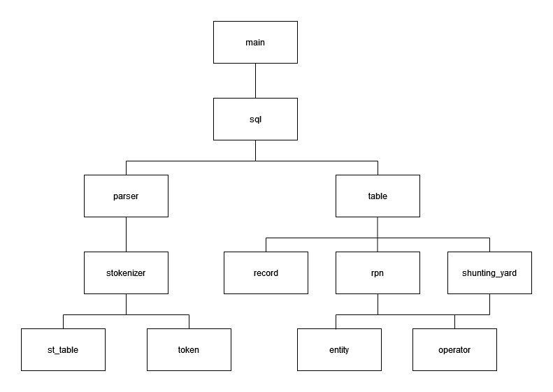

<a name="readme-top"></a>

<!-- PROJECT LOGO -->
<br />
<div align="center">
  <a href="https://github.com/cgarcia156/My-Local-Database">
    
  </a>
  
  <h3 align="center">My Local Database</h3>

  <p align="center">
    <br />
    <a href="https://github.com/cgarcia156/My-Local-Database">View Demo</a>
    ·
    <a href="https://github.com/cgarcia156/My-Local-Database/issues">Report Bug</a>
    ·
    <a href="https://github.com/cgarcia156/My-Local-Database/issues">Request Feature</a>
  </p>
</div>


<!-- TABLE OF CONTENTS -->
<details>
  <summary>Table of Contents</summary>
  <ol>
    <li>
      <a href="#about-the-project">About The Project</a>
      <ul>
        <li><a href="#key-dependencies">Key Dependencies</a></li>
        <li><a href="#built-with">Built With</a></li>
      </ul>
    </li>
    <li>
      <a href="#getting-started">Getting Started</a>
      <ul>
        <li><a href="#prerequisites">Prerequisites</a></li>
        <li><a href="#installation">Installation</a></li>
      </ul>
    </li>
    <li><a href="#usage">Usage</a></li>
    <li><a href="#contact">Contact</a></li>
  </ol>
</details>


<!-- ABOUT THE PROJECT -->
## About The Project

[![Product Name Screen Shot][product-screenshot]](https://example.com)

<br>

My Local Database stores data locally on the device's disk, with the information for each table being stored in its own binary file.
We can interact with these tables by using commands similar to SQL (CREATE, INSERT, SELECT, DELETE, DROP). The data can be filtered 
by selecting specific columns or by using conditions (<,>,<=,>=,=,AND,OR) when using the WHERE command along with SELECT. 
The program is interactive, but we can also store commands in a file and run them as a batch instead of entering them in manually.
See the specific format of commands <a href="#usage">here</a>.


<p align="right">(<a href="#readme-top">back to top</a>)</p>

### Key Dependencies
Note: This diagram ignores self-implemented data structures


<p align="right">(<a href="#readme-top">back to top</a>)</p>

### Built With

C++


<!-- GETTING STARTED -->
## Getting Started

This is an example of how you may give instructions on setting up your project locally.
To get a local copy up and running follow these simple example steps.

### Prerequisites

This is an example of how to list things you need to use the software and how to install them.
* npm
  ```sh
  npm install npm@latest -g
  ```

### Installation

_Below is an example of how you can instruct your audience on installing and setting up your app. This template doesn't rely on any external dependencies or services._

1. Get a free API Key at [https://example.com](https://example.com)
2. Clone the repo
   ```sh
   git clone https://github.com/your_username_/Project-Name.git
   ```
3. Install NPM packages
   ```sh
   npm install
   ```
4. Enter your API in `config.js`
   ```js
   const API_KEY = 'ENTER YOUR API';
   ```

<p align="right">(<a href="#readme-top">back to top</a>)</p>


<!-- USAGE EXAMPLES -->
## Usage

Use this space to show useful examples of how a project can be used. Additional screenshots, code examples and demos work well in this space. You may also link to more resources.

_For more examples, please refer to the [Documentation](https://example.com)_

<p align="right">(<a href="#readme-top">back to top</a>)</p>


<!-- CONTACT -->
## Contact

Christian Garcia - christiangarcia.cg77@gmail.com

Project Link: [https://github.com/cgarcia156/Database](https://github.com/cgarcia156/Database)

<p align="right">(<a href="#readme-top">back to top</a>)</p>

[product-screenshot]: images/screenshot.png

